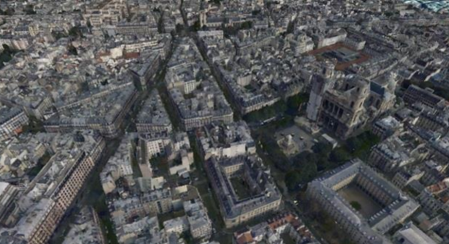

<!-- .slide: data-background="../template/images/Slide1.png" -->

<!--div style="margin: auto; padding-top: 50px; padding-bottom: 50px; width: 80%; background: rgba(30,30,30,0.9)"/-->

<h1>Your talk</h1>
### _subtitle_

<br>

Jack D, Esri

---

<!-- .slide: data-background="../template/images/Slide5.png" -->

## Table of contents

1. ArcGIS
  - API for JavaScript
  - Working with the 3D SceneView
  - Indexed 3D Scene Layers
1. Building a 3D Web Application &mdash; Part 1
  - Data acquisition &amp; processing
  - Data publishing &amp; viewing
1. Building a 3D Web Application &mdash; Part 2
  - Show case: Building a custom 3D application

---


<!-- .slide: data-background="../template/images/Slide2.png" -->

## ArcGIS Platform


---


<!-- .slide: data-background="../template/images/Slide2.png" -->

## ArcGIS API for JavaScript
### _4.x Foundations_

---


<!-- .slide: data-background="../template/images/Slide2.png" -->

### JavaScript API &mdash; _Basic Concepts_

- Unified 2D and 3D [`Map`](https://developers.arcgis.com/javascript/latest/api-reference/esri-Map.html) data model:
  - [`Layer`](https://developers.arcgis.com/javascript/latest/api-reference/esri-layers-Layer.html) &mdash; Fundamental Map component
  - [`Renderer`](https://developers.arcgis.com/javascript/latest/api-reference/esri-renderers-Renderer.html) &mdash; Visualization Methods
  - [`Symbol`](https://developers.arcgis.com/javascript/latest/api-reference/esri-symbols-Symbol.html) &mdash; Symbolization Instructions
- Common [`View`](https://developers.arcgis.com/javascript/latest/api-reference/esri-views-View.html) subclass between 2D and 3D:
  - [`MapView`](https://developers.arcgis.com/javascript/latest/api-reference/esri-views-MapView.html) &mdash; 2D Visualization
  - [`SceneView`](https://developers.arcgis.com/javascript/latest/api-reference/esri-views-SceneView.html) &mdash; 3D Visualization
- Makes it easy to transition between 2D and 3D
- To use 3D effectively one needs to understand 3D concepts

---


<!-- .slide: data-background="../template/images/Slide2.png" -->

### JavaScript API &mdash; _2D &amp; 3D Viewing_

<div class="twos">
  <div class="snippet">
  <pre><code class="lang-js hljs javascript">
var map = new Map({
  basemap: "streets-vector",

  layers: [new FeatureLayer(
    "...Ward_-_2016/FeatureServer/0"
  )]
});

viewLeft = new MapView({
  container: "viewDivLeft",

  map: map
});

viewRight = new SceneView({
  container: "viewDivRight",

  map: map
});

</code></pre>
  </div>
  <div class="snippet-preview">
    <iframe id="frame-2d-parallel" data-src="./snippets/setup-3d-view-2d-parallel.html"></iframe>
  </div>
</div>

---


<!-- .slide: data-background="../template/images/Slide2.png" -->

### JavaScript API &mdash; _Object Construction_

- Unified object construction
- &ldquo;Auto-casting&rdquo; implicitly calls constructor of corresponding type


```js
var view = new SceneView({
  map: new Map({
    basemap: "topo"
  }),

  extent: {
    xmin: -180, xmax: 180, ymin: -90, ymax: 90,
    spatialReference: 120100
  },

  environment: {
    lighting: {
      date: new Date("Mon Jan 30 2017 18:00:00 GMT-8")
    }
  }
});
```

---


<!-- .slide: data-background="../template/images/Slide2.png" -->

### JavaScript API &mdash; _Object Properties_

- Properties can be observed and watchers receive change notifications

<div class="twos">
  <div class="snippet">
  <pre><code class="lang-js hljs javascript">view.watch("center", (value) => {
  // Called whenever the center property value has changed
  console.log("center set to:", value.longitude, value.latitude);
});

// Auto-cast allows omitting constructing a new Point instance
view.center = {
  x: -115.94,
  y: 33.8
};</code></pre>
  <svg data-play-frame="frame-center" class="play-code" viewBox="0 0 24 24"><path fill="#999" d="M12,20.14C7.59,20.14 4,16.55 4,12.14C4,7.73 7.59,4.14 12,4.14C16.41,4.14 20,7.73 20,12.14C20,16.55 16.41,20.14 12,20.14M12,2.14A10,10 0 0,0 2,12.14A10,10 0 0,0 12,22.14A10,10 0 0,0 22,12.14C22,6.61 17.5,2.14 12,2.14M10,16.64L16,12.14L10,7.64V16.64Z" /></svg>
  </div>
  <div class="snippet-preview">
    <iframe id="frame-center" data-src="./snippets/setup-3d-view-center.html"></iframe>
  </div>
</div>

---


<!-- .slide: data-background="../template/images/Slide2.png" -->

### JavaScript API &mdash; _Promises_

- All asynchronous operations are modeled as a `Promise`
- Certain classes _are_ promises themselves ([`SceneView`](https://developers.arcgis.com/javascript/latest/api-reference/esri-views-SceneView.html), [`MapView`](https://developers.arcgis.com/javascript/latest/api-reference/esri-views-MapView.html), [`Layer`](https://developers.arcgis.com/javascript/latest/api-reference/esri-layers-Layer.html))
- `Promises` are chainable and allow writing sequential asynchronous code

```js
view
    .then(() => {
      // View is ready to be interacted with, load the layer
      return layer.load();
    })

    .then(() => {
      // Layer is now loaded, project extent using geometry service
      return geometryService.project([layer.fullExtent]);
    })

    .then((projected) => {
      // Extent has been projected, we can now go to it
      return view.goTo(projected[0]);
    })

    .then(() => {
      // Here the gotTo animation has finished
    });
```

---


<!-- .slide: data-background="../template/images/Slide2.png" -->

## ArcGIS API for JavaScript
### _Working with the 3D SceneView_

---


<!-- .slide: data-background="../template/images/Slide2.png" -->

### SceneView &mdash; _The 3D View_

- The [`SceneView`](https://developers.arcgis.com/javascript/latest/api-reference/esri-views-SceneView.html) provides 3D specific functionality


```ts
class SceneView {
  // Camera specifies the view
  camera: Camera;

  // Programmatic navigation
  goTo(...);

  // Settings that affect constraints (e.g. navigation constraints)
  constraints: SceneViewConstraints;

  // Padding on the view
  padding: { top: number, right: number, bottom: number, left: number };

  // Quality profile
  qualityProfile: string;

  // Converting coordinate systems
  toScreen(mapPoint: Point): ScreenPoint;
  toMap(screenPoint: ScreenPoint): Point;
}
```

---


<!-- .slide: data-background="../template/images/Slide2.png" -->


### SceneView &mdash; _Camera Definition_

- 3D viewing parameters in a [`SceneView`](https://developers.arcgis.com/javascript/latest/api-reference/esri-views-SceneView.html) are controlled by [`esri/Camera`](https://developers.arcgis.com/javascript/latest/api-reference/esri-Camera.html)

```ts
class Camera {
  // The position of the camera eye in 3D space (`x`, `y` + `z` elevation)
  position: Point;

  // The heading angle (towards north in degrees, [0, 360]°)
  heading: number;

  // The tilt angle ([0, 180]°, with 0° straight down, 90° horizontal)
  tilt: number;
}
```

---


<!-- .slide: data-background="../template/images/Slide2.png" -->

### SceneView &mdash; _Camera Interaction_

- Changing [`SceneView.camera`](https://developers.arcgis.com/javascript/latest/api-reference/esri-views-SceneView.html#camera) immediately updates the 3D view

<div class="twos">
  <div class="snippet">
  <pre><code class="lang-js hljs javascript">// Get a copy of the current camera
var camera = view.camera.clone();

// Increment the heading of the camera by 5 degrees
camera.heading += 5;

// Set the modified camera on the view
view.camera = camera;</code></pre>
  <svg data-play-frame="frame-camera-heading-increment" class="play-code" viewBox="0 0 24 24"><path fill="#999" d="M12,20.14C7.59,20.14 4,16.55 4,12.14C4,7.73 7.59,4.14 12,4.14C16.41,4.14 20,7.73 20,12.14C20,16.55 16.41,20.14 12,20.14M12,2.14A10,10 0 0,0 2,12.14A10,10 0 0,0 12,22.14A10,10 0 0,0 22,12.14C22,6.61 17.5,2.14 12,2.14M10,16.64L16,12.14L10,7.64V16.64Z" /></svg>
  </div>
  <div class="snippet-preview">
    <iframe id="frame-camera-heading-increment" data-src="./snippets/setup-3d-view-camera-heading-increment.html"></iframe>
  </div>
</div>

---


<!-- .slide: data-background="../template/images/Slide2.png" -->

### SceneView &mdash; _View Navigation_

- Use [`SceneView.goTo(target[, options])`](https://developers.arcgis.com/javascript/latest/api-reference/esri-views-SceneView.html#goTo) to navigate
 - Supports different targets: `Camera`, `Geometry`, `Geometry[]`, `Graphic`, `Graphic[]`
 - Supports specifying desired `scale`, `position`, `heading` and `tilt`
 - Allows specifying animation options: `animate`, `speedFactor` or `duration`, `easing`
 - Returns a `Promise` which resolves when the animation has finished

---


<!-- .slide: data-background="../template/images/Slide2.png" -->

### SceneView &mdash; _View Navigation &num;1_

- Use [`SceneView.goTo()`](https://developers.arcgis.com/javascript/latest/api-reference/esri-views-SceneView.html#goTo) to view a set of graphics at a certain scale, heading and tilt

<div class="twos">
  <div class="snippet">
  <pre><code class="lang-js hljs javascript">// Specify a target and additional
// parameters to further control the view
view.goTo({

  // The target is a set of graphics which should be
  // brought into view
  target: view.graphics

  // Additionally, define at which scale, heading and tilt
  // these graphics should be viewed
  scale: 5000,
  heading: 30,
  tilt: 60
});
</code></pre>
  <svg data-play-frame="frame-goto-graphics" class="play-code" viewBox="0 0 24 24"><path fill="#999" d="M12,20.14C7.59,20.14 4,16.55 4,12.14C4,7.73 7.59,4.14 12,4.14C16.41,4.14 20,7.73 20,12.14C20,16.55 16.41,20.14 12,20.14M12,2.14A10,10 0 0,0 2,12.14A10,10 0 0,0 12,22.14A10,10 0 0,0 22,12.14C22,6.61 17.5,2.14 12,2.14M10,16.64L16,12.14L10,7.64V16.64Z" /></svg>
  </div>
  <div class="snippet-preview">
    <iframe id="frame-goto-graphics" data-src="./snippets/setup-3d-view-goto-graphics.html"></iframe>
  </div>
</div>

---


<!-- .slide: data-background="../template/images/Slide2.png" -->

### SceneView &mdash; _View Navigation &num;2_

- Use [`SceneView.goTo()`](https://developers.arcgis.com/javascript/latest/api-reference/esri-views-SceneView.html#goTo) to create a smooth camera animation on the 3D view

<div class="twos">
  <div class="snippet">
  <pre><code class="lang-js hljs javascript">var h = view.camera.heading;

// Set the heading of the view to
// the closest multiple of 30 degrees
var heading = Math.floor(h / 30) * 30 + 30;

// go to heading preserves view.center
view.goTo({
  heading: heading
});
</code></pre>
  <svg data-play-frame="frame-goto-heading" class="play-code" viewBox="0 0 24 24"><path fill="#999" d="M12,20.14C7.59,20.14 4,16.55 4,12.14C4,7.73 7.59,4.14 12,4.14C16.41,4.14 20,7.73 20,12.14C20,16.55 16.41,20.14 12,20.14M12,2.14A10,10 0 0,0 2,12.14A10,10 0 0,0 12,22.14A10,10 0 0,0 22,12.14C22,6.61 17.5,2.14 12,2.14M10,16.64L16,12.14L10,7.64V16.64Z" /></svg>
  </div>
  <div class="snippet-preview">
    <iframe id="frame-goto-heading" data-src="./snippets/setup-3d-view-goto-heading.html"></iframe>
  </div>
</div>

---


<!-- .slide: data-background="../template/images/Slide2.png" -->

### SceneView &mdash; _View Navigation &num;3_

- Use [`SceneView.goTo()`](https://developers.arcgis.com/javascript/latest/api-reference/esri-views-SceneView.html#goTo) `options` to control the animation

<div class="twos">
  <div class="snippet">
  <pre><code class="lang-js hljs javascript">function rotateView(easing) {
  var cam = view.camera.clone();
  cam.position = {
      longitude: cam.position.longitude + 90,
      ...
  };

  return view.goTo({
    target: cam
  }, {
    easing: easing,
    ...
  });
}

rotateView("linear")

.then(function() {
  return rotateView("in-out-cubic");
})

.then(function() {
  rotateView("in-out-expo");
});
</code></pre>
  <svg data-play-frame="frame-goto-options" class="play-code" viewBox="0 0 24 24"><path fill="#999" d="M12,20.14C7.59,20.14 4,16.55 4,12.14C4,7.73 7.59,4.14 12,4.14C16.41,4.14 20,7.73 20,12.14C20,16.55 16.41,20.14 12,20.14M12,2.14A10,10 0 0,0 2,12.14A10,10 0 0,0 12,22.14A10,10 0 0,0 22,12.14C22,6.61 17.5,2.14 12,2.14M10,16.64L16,12.14L10,7.64V16.64Z" /></svg>
  </div>
  <div class="snippet-preview">
    <iframe id="frame-goto-options" data-src="./snippets/setup-3d-view-goto-options.html"></iframe>
  </div>
</div>

---


<!-- .slide: data-background="../template/images/Slide2.png" -->

### SceneView &mdash; _View Constraints_

- Use [`SceneView.constraints`](https://developers.arcgis.com/javascript/latest/api-reference/esri-views-SceneView.html#constraints) to control navigation and rendering aspects

<div class="twos">
  <div class="snippet">
  <pre><code class="lang-js hljs javascript">// The minimum and maximum allowed
// altitude (camera.position.z) of the camera.
view.constraints.altitude = {
  min: 10000000, // 10'000 km
  max: 30000000 // 30'000 km
};

// Set the clip distance near/far values
// to override the default clipping heuristics
view.constraints.clipDistance = {
  near: 10000000, // 10'000 km
  far: 40000000 // 40'000 km
};

</code></pre>
  <svg data-play-frame="frame-constraints-altitude" class="play-code" viewBox="0 0 24 24"><path fill="#999" d="M12,20.14C7.59,20.14 4,16.55 4,12.14C4,7.73 7.59,4.14 12,4.14C16.41,4.14 20,7.73 20,12.14C20,16.55 16.41,20.14 12,20.14M12,2.14A10,10 0 0,0 2,12.14A10,10 0 0,0 12,22.14A10,10 0 0,0 22,12.14C22,6.61 17.5,2.14 12,2.14M10,16.64L16,12.14L10,7.64V16.64Z" /></svg>
  </div>
  <div class="snippet-preview">
    <iframe id="frame-constraints-altitude" data-src="./snippets/setup-3d-view-constraints-altitude.html"></iframe>
  </div>
</div>

---


<!-- .slide: data-background="../template/images/Slide2.png" -->

### SceneView &mdash; _View Padding_

- Use [`SceneView.padding`](https://developers.arcgis.com/javascript/latest/api-reference/esri-views-SceneView.html#constraints) to focus on a subsection of the view
- Primarily affects UI and navigation

<div class="twos">
  <div class="snippet">
  <pre><code class="lang-js hljs javascript">// Set the padding to make
// space for a sidebar and a header
view.padding = {
  top: 30,
  left: 150
};
</code></pre>
  <svg data-play-frame="frame-padding" class="play-code" viewBox="0 0 24 24"><path fill="#999" d="M12,20.14C7.59,20.14 4,16.55 4,12.14C4,7.73 7.59,4.14 12,4.14C16.41,4.14 20,7.73 20,12.14C20,16.55 16.41,20.14 12,20.14M12,2.14A10,10 0 0,0 2,12.14A10,10 0 0,0 12,22.14A10,10 0 0,0 22,12.14C22,6.61 17.5,2.14 12,2.14M10,16.64L16,12.14L10,7.64V16.64Z" /></svg>
  </div>
  <div class="snippet-preview">
    <iframe id="frame-padding" data-src="./snippets/setup-3d-view-padding.html"></iframe>
  </div>
</div>

---


<!-- .slide: data-background="../template/images/Slide2.png" -->

### SceneView &mdash; _View Quality_

- Use [`qualityProfile`](https://developers.arcgis.com/javascript/latest/api-reference/esri-views-SceneView.html#constraints) and [`quality`](https://developers.arcgis.com/javascript/latest/api-reference/esri-views-SceneView.html#constraints) to control performance and quality of the visualizations
- Affects: Map resolution, scene level detail, anti-aliasing, atmosphere

<div class="twos">
  <div class="snippet">
  <pre><code class="lang-js hljs javascript">
var map = new Map({
  basemap: "hybrid"
});

viewLeft = new SceneView({
  map: map,
  qualityProfile: "low",

  environment: {
    atmosphere: { quality: "low" }
  }
});

viewRight = new SceneView({
  map: map,
  qualityProfile: "high"

  environment: {
    atmosphere: { quality: "high" }
  }
});
</code></pre>
  <svg data-play-frame="frame-quality-profile" class="play-code" viewBox="0 0 24 24"><path fill="#999" d="M12,20.14C7.59,20.14 4,16.55 4,12.14C4,7.73 7.59,4.14 12,4.14C16.41,4.14 20,7.73 20,12.14C20,16.55 16.41,20.14 12,20.14M12,2.14A10,10 0 0,0 2,12.14A10,10 0 0,0 12,22.14A10,10 0 0,0 22,12.14C22,6.61 17.5,2.14 12,2.14M10,16.64L16,12.14L10,7.64V16.64Z" /></svg>
  </div>
  <div class="snippet-preview">
    <iframe id="frame-quality-profile" data-src="./snippets/setup-3d-view-quality-profile.html"></iframe>
  </div>
</div>

---


<!-- .slide: data-background="../template/images/Slide2.png" -->

### SceneView &mdash; _Map vs. Screen Points_

- Use [`SceneView.toMap`](https://developers.arcgis.com/javascript/latest/api-reference/esri-views-SceneView.html#toMap)/[`toScreen`](https://developers.arcgis.com/javascript/latest/api-reference/esri-views-SceneView.html#toScreen) to transform between the map and screen coordinates

<div class="twos">
  <div class="snippet">
  <pre><code class="lang-js hljs javascript">var view = new SceneView({
  map: new Map({
    basemap: "satellite"
  })
});

for (var x = 1; x <= 2; x++) {
  for (var y = 1; y <= 2; y++) {
    var px = x &lowast; (view.width / 3);
    var py = y &lowast; (view.height / 3);

    view.graphics.add(view.toMap(px, py), symbol);
  }
}

view.watch("camera", () => {
  console.log(view.graphics.map((graphic) => {
    var pt = view.toScreen(graphic.geometry);

    return "[" + pt.x + ", " + pt.y + "]";
  }).join(", "));
});
</code></pre>
  <svg data-play-frame="frame-to-map" class="play-code" viewBox="0 0 24 24"><path fill="#999" d="M12,20.14C7.59,20.14 4,16.55 4,12.14C4,7.73 7.59,4.14 12,4.14C16.41,4.14 20,7.73 20,12.14C20,16.55 16.41,20.14 12,20.14M12,2.14A10,10 0 0,0 2,12.14A10,10 0 0,0 12,22.14A10,10 0 0,0 22,12.14C22,6.61 17.5,2.14 12,2.14M10,16.64L16,12.14L10,7.64V16.64Z" /></svg>
  </div>
  <div class="snippet-preview">
    <iframe id="frame-to-map" data-src="./snippets/setup-3d-view-to-map.html"></iframe>
  </div>
</div>

---


<!-- .slide: data-background="../template/images/Slide4.png" -->

## ArcGIS API for JavaScript
### _Indexed 3D Scene Layers_

---


<!-- .slide: data-background="../template/images/Slide2.png" -->

### Indexed 3D Scene Layers &mdash; _Fundamentals_
<br>

- Stream data format designed to support 3D geospatial content
- Provides level of detail using advanced tree traversal algorithms
- Supports different layer types and data profiles
- Uses request scheduling to achieve optimal performance

---


<!-- .slide: data-background="../template/images/Slide2.png" -->

### Indexed 3D Scene Layers &mdash; _Layer Types_

<table style="border: 1px solid">
  <tr style="background: rgba(255, 255, 255, 0.2)">
    <td><b>Type</b></td>
    <td><b>Data</b></td>
    <td></td>
  </tr>
  <tr>
    <td style="vertical-align: middle">3D Objects</td>
    <td style="vertical-align: middle">Multipatch</td>
    <td></td>
  </tr>
  <tr>
    <td style="vertical-align: middle">Integrated Mesh</td>
    <td style="vertical-align: middle">VRICON / Drone2Map</td>
    <td></td>
  </tr>
  <tr>
    <td style="vertical-align: middle">Points</td>
    <td style="vertical-align: middle">-</td>
    <td></td>
  </tr>
  <tr>
    <td style="vertical-align: middle">PointClouds</td>
    <td style="vertical-align: middle">LAS</td>
    <td></td>
  </tr>
</table>

---


<!-- .slide: data-background="../template/images/Slide2.png" -->

### Indexed 3D Scene Layers &mdash; _Level Of Detail_

<br>

<div class="twos">
  <div>
    Tiled View<br>
    
  </div>
  <div>
    Node Structure<br>
    
  </div>
</div>

---

<!-- .slide: data-background="../template/images/Slide4.png" -->

## Building a 3D Web Application
### _Data acquisition &amp; processing_

---


<!-- .slide: data-background="../template/images/Slide2.png" -->

## Cover Story
### _Hurricane Matthew_


---

<!-- .slide: data-background="../template/images/Slide2.png" -->

### Building a 3D Web Application &mdash; _Data Acquisition_


- Florida geographic data library &mdash; [FGDL](http://www.fgdl.org/)
  - Parcel information for all counties in Florida
- National Oceanic and Atmospheric Administration &mdash; [NOAA](http://www.nhc.noaa.gov/gis/)
  - Potential Storm Surge Flooding (Inundation)
<br>
- Limit scope to Florida's Brevard county (sand spit)

---


<!-- .slide: data-background="../template/images/Slide2.png" -->

### Building a 3D Web Application &mdash; _Data Processing_

 Use [Esri CityEngine](http://www.esri.com/software/cityengine) to create 3D models of residential housing from parcel data

<div class="twos">
  <div>
    
  </div>
  <div class="snippet">
  <pre><code class="lang-js hljs javascript">attr height = 6

Lot -->
  split(x) { ~1 : NIL
           | scope.sx : split(z) { ~1 : NIL
                                 | scope.sx : Parcel
                                 | ~1 : NIL }
           | ~1 : NIL }

Parcel -->
  innerRectangle(edge) { shape : Building
                       | remainder : NIL }

Building -->
  extrude (height)
  Mass.
  comp(f) { top : Roof }

Roof -->
  roofGable(30)</code></pre>
  </div>
  <div>
    
  </div>
</div>


---


<!-- .slide: data-background="../template/images/Slide2.png" -->

### Building a 3D Web Application &mdash; _Data Processing_

 Use [ArcGIS Pro](http://www.esri.com/en/software/arcgis-pro) to import NOAA weather data

<div class="twos">
  <div>
    <ul>
      <li/>Create separate layer for each forecast
      <li/>Raster to Polygon Tool
      <li/>Set layer symbology
    </ul>
  </div>
  <div>
    
  </div>
</div>


---


<!-- .slide: data-background="../template/images/Slide2.png" -->

### Building a 3D Web Application &mdash; _Data Publishing &amp; Viewing_

- Use [ArcGIS Pro](http://www.esri.com/en/software/arcgis-pro) to publish the contents to the [ArcGIS Online](https://www.arcgis.com/home/index.html) platform
- Use [ArcGIS Online 3D Scene Viewer](http://www.esri.com/software/scene-viewer) to explore the published dataset


---


<!-- .slide: data-background="../template/images/Slide4.png" -->

## Building a custom 3D Web Application
### _Using our JavaScript 4.x API_

#### [developers.arcgis.com/javascript](https://developers.arcgis.com/javascript)

<aside class="notes">
Now we're going to create a web application using the ArcGIS JavaScript API Version 4.x

<p>We'll be using the same hurricane data and create a practical app. I will be refering to developers.arcgis.com/javascript throughout the walkthrough</p>
<p>Everything I do will have sample code and API refrences. I'll actually even be bringing this up as we move along.</p>

</aside>

---

<!-- .slide: data-background="../template/images/Slide2.png" -->

### Loading Portal Item

<div class="twos">
  <div class="snippet">
  <pre><code class="lang-js hljs javascript">require([
  "esri/config",
  "esri/Camera",
  "esri/WebScene",
  "esri/views/SceneView",
  "dojo/domReady!"
], function(esriConfig, Camera, WebScene, SceneView) {

  //Adding the portal URL
  esriConfig.portalUrl = "//jsapi.maps.arcgis.com";

  //Adding the portal ID
  var scene = new WebScene({
    portalItem: {
      id: "08b87d5949ea44e2a94d1b6efd95007b"
    }
  });

  var view = new SceneView({
    map: scene,
    container: "viewDiv"
  });
});</code></pre>
  </div>
  <div class="snippet-preview">
    <iframe data-src="./snippets/demo-addingPortal.html"></iframe>
  </div>
</div>

<aside class="notes">
Let's start by adding the hurricane data to our application

<p>To actually do this, we can simple just paste in the portal ID for that scene</p>

<p>I will go over to developers.arcgis.com and show you what I'd have to do to put it in </p>

<p>you'll see that all I've done is added in the portal id.</p>
</aside>

---


<!-- .slide: data-background="../template/images/Slide4.png" -->

## Adding functionality
### _OnClick & reverse geocode_

---


<!-- .slide: data-background="../template/images/Slide2.png" -->

### Adding a view.on("click") function to query building information.

<div class="twos">
  <div class="snippet">
  <pre><code class="lang-js hljs javascript">...
var view = new SceneView({
  map: scene,
  container: "viewDiv"
});

view.on("click", function(evt) {
  var screenPoint = evt.screenPoint;

  // the hitTest() checks to see if any graphics in the view
  // intersect the given screen point
  view.hitTest(screenPoint)
});</code></pre>
  </div>
  <div class="snippet-preview">
    <iframe data-src="./snippets/demo-addingClick.html"></iframe>
  </div>
</div>

<aside class="notes">

To make it more interactive we can add an onClick

<p>All we're doing is adding an on click function that will tell us more information about what we are looking at.</p>

<p>If we refer to the arcgis website. We can search for "onclick" and you can see how simple it is to add this in the scene.</p>

<p>Theres a slight change in the code for me. I added a couple lines that will basically return the feature layer information when I hit graphics.</p>

</aside>

---


<!-- .slide: data-background="../template/images/Slide2.png" -->

### Find address onclick - reverse geocode

<div class="twos">
  <div class="snippet">
  <pre><code class="lang-js hljs javascript">...
view.hitTest(screenPoint)
var lat = evt.mapPoint.latitude
var lon = evt.mapPoint.longitude

view.popup.open({
  // Set the popup's title to the coordinates of the location
  title: "Reverse geocode: [" + lon + ", " + lat + "]",
  location: evt.mapPoint
});

// Execute a reverse geocode using the clicked location
locatorTask.locationToAddress(evt.mapPoint).then(function(response) {
  // If an address is successfully found, print it to the popup's content
  var address = response.address.Match_addr;
  view.popup.content = address;
})

</code></pre>
  </div>
  <div class="snippet-preview">
    <iframe data-src="./snippets/demo-addingClickGeocode.html"></iframe>
  </div>
</div>

<aside class="notes">

We can do more than just get information that's preset in the buildings.

<p>What this code will do is reverse geocode</p>

<p>This is using geography with the preset dataset attached to the buildings.</p>

<p>It all adds up to create a more functional building.</p>

</aside>

---


<!-- .slide: data-background="../template/images/Slide4.png" -->

## Visual emphasis
### _Extruding polygons proportional to forecast flood height_

---


<!-- .slide: data-background="../template/images/Slide2.png" -->

### PolygonSymbol3D &amp; ExtrudeSymbol3DLayer

<div class="twos">
  <div class="snippet">
  <pre><code class="lang-js hljs javascript">...
//query for each seperate feature layer
var hurricaneRenderer = new SimpleRenderer({
  symbol: new PolygonSymbol3D({
    symbolLayers: [
      new ExtrudeSymbol3DLayer()
    ]
  }),
  visualVariables: [{
    type: "color",
    field: "gridcode",
    maxDataValue: 4,
    stops: [{ value: 1, color: "#F5F500" },
            { value: 2, color: "#F57A00" },
            { value: 3, color: "#F50000" },
            { value: 4, color: "#F00"}]
  },{
    type: "size",
    field: "gridcode",
    valueUnit: "feet",
    stops: [{ value: 1, size: 1 },
            { value: 2, size: 3 },
            { value: 3, size: 5 },
            { value: 4, size: 8 },
            { value: 5, size: 12 }]
  }]
});</code></pre>
  </div>
  <div class="snippet-preview">
    <iframe data-src="./snippets/demo-addingBevel.html"></iframe>
  </div>
</div>

<aside class="notes">

We can do something called polygon extrusion. That basically means any polygon we can add a z axis too.

<p>A good example of this would be to visualize the dangerous areas with a greater z axis</p>

<p>What we can see in the code is that we're beveling out all of our feature layers to really take use of our 3D capabilities</p>

</aside>

---


<!-- .slide: data-background="../template/images/Slide4.png" -->

## Adding more functionality
### _Address searching - find out if your home will be affected_

---


<!-- .slide: data-background="../template/images/Slide2.png" -->

<div class="snippet-preview">
  <iframe data-src="./snippets/demo-addingSearch.html"></iframe>
</div>

---


<!-- .slide: data-background="../template/images/Slide4.png" -->

## Making it look more realistic
### _Lighting, shadows and atmosphere_

---

<!-- .slide: data-background="../template/images/Slide2.png" -->

### Adding Satellite imagery and environment effects

<div class="twos">
  <div class="snippet">
  <pre><code class="lang-js hljs javascript">...
view.environment.atmosphere.quality = "high"
view.environment.lighting.cameraTrackingEnabled = true;
view.environment.lighting.ambientOcclusionEnabled = true;
view.environment.lighting.directShadowsEnabled = true;
view.environment.starsEnabled = true;

    </code></pre>
  </div>
  <div class="snippet-preview">
    <iframe data-src="./snippets/demo-addingEnvironment.html"></iframe>
  </div>
</div>

<aside class="notes">

With a couple lines of code, we can make the scene much more realistic.

<p>The environmental effects that you see above will add noticable but subtle improvements to the scene.</p>

<p>Also you can notice i've added a basemap toggle too. Swaps the basemap imagery to something more realistic if needed.</p>

</aside>

---


<!-- .slide: data-background="../template/images/Slide4.png" -->

## Final app
### _Rather simply created a functional app_

<aside class="notes">

This is a very simple app that would be very difficult to create without the use of an API.

<p>The sample code and reference makes it rather simple to create any app you'd like</p>

<p>There's a lot of potential to this app. If we changed the feature layer from a static to realtime data or predictive data... then it really makes a powerful app to find out who should be evacuated.</p>

</aside>

---


<!-- .slide: data-background="../template/images/Slide2.png" -->

## Summary

- Get started with 3D GIS on the web, replace [`MapView`](https://developers.arcgis.com/javascript/latest/api-reference/esri-views-MapView.html) with [`SceneView`](https://developers.arcgis.com/javascript/latest/api-reference/esri-views-SceneView.html)!
- Let us know about your applications, ideas, questions, issues
  - David Martinez &mdash; [dmartinez@esri.com](mailto:dmartinez@esri.com)

---

<!-- .slide: data-background="../template/images/Slide6.png" -->
