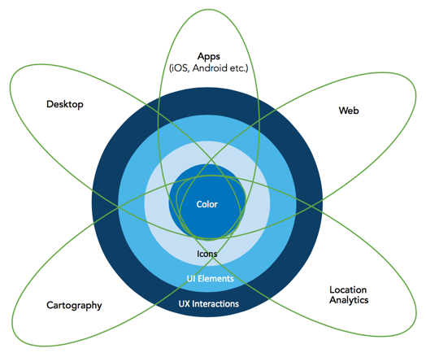

<!-- .slide: data-background="../template/images/Slide1.png" -->

<!--div style="margin: auto; padding-top: 50px; padding-bottom: 50px; width: 80%; background: rgba(30,30,30,0.9)"/-->

<h1>Designing Apps with</h1>
### _Calcite Maps_

 

David Martinez, Esri 

---

<!-- .slide: data-background="../template/images/Slide2.png" -->

## Calcite
#### _Design system created by Esri_

  

    
ArcGIS Pro

  
    

  

     
ArcGIS JS

  

  
 

---

<!-- .slide: data-background="../template/images/Slide4.png" -->

## Calcite Web

---

<!-- .slide: data-background="../template/images/Slide2.png" -->

## Calcite Web

- Web framework developed by Esri
- Calcite - colors, fonts, icons...
- Branding guide and style for web pages
- Light-weight, fast, responsive
- Sass, JS, documentation

 [github.com/Esri/calcite-web](https://github.com/Esri/calcite-web)

---

<!-- .slide: data-background="../template/images/Slide2.png" -->

## Calcite Bootstrap

 [github.com/Esri/calcite-bootstrap](https://github.com/Esri/calcite-bootstrap)

---

<!-- .slide: data-background="../template/images/Slide4.png" -->

## Calcite Maps

---

<!-- .slide: data-background="../template/images/Slide2.png" -->

## Calcite Maps

- A theme using Calcite styles and Bootstrap
- Responsive web map apps
- Calcite - colors, fonts, icons...
- Light and dark themes
- Custom CSS components, build, Sass, documentation
- Dojo and jQuery
- ArcGIS 3.x, 4.x, Esri-Leaflet

---

<!-- .slide: data-background="../template/images/Slide2.png" -->

## Getting Started

1. HTML
2. Reference CSS
  - Bootstrap
  - Calcite Maps
3. Reference JavaScript
  - Mapping API (ArcGIS JavaScript API)
  - Calcite Maps JS
  - DojoBootstrap or jQuery

 [github.com/Esri/calcite-maps](https://github.com/Esri/calcite-maps)

---

<!-- .slide: data-background="../template/images/Slide2.png" -->

## Styles

- Layout - top, bottom, margins
- Dropdown - standard, drawer
- Panels - left, right
- Themes - light, dark, custom
- Colors - Calcite
- Search - expand/collapse
- Full map
- Widget themes

 [Explore with examples and Styler](https://github.com/Esri/calcite-maps)

---

<!-- .slide: data-background="../template/images/Slide2.png" -->

## Dev Options

1. Access compiled CSS directly
2. Integrate Sass
3. Create custom Sass build
  - Fork - Bower - npm - grunt
 

---

<!-- .slide: data-background="../template/images/Slide4.png" -->

## Calcite Maps
### Application Template Styler

---

<!-- .slide: data-background="../template/images/Slide2.png" -->

## Styler App Template

- Configurable app template built with ArcGIS JS 4x
- Calcite Maps (Bootstrap)
- Extends the application-boilerplate
- WebMap (2D) and WebScene (3D) support
- Highly configurable
- Responsive

---

<!-- .slide: data-background="../template/images/Slide2.png" -->

## Bonus!

- Access app default webmap and webscene
- Override via JSON or URL with params
- Widget extensions (Find places, coords, full map...)
- Source code on GitHub

 [github.com/Esri/calcite-maps-styler-template](https://github.com/Esri/calcite-maps-styler-template)

---

<!-- .slide: data-background="../template/images/Slide2.png" -->

## Summary

- Calcite is a design system created by Esri
- Calcite Maps - Theme for Bootstrap
- Styler - *New* ArcGIS JS v4 configurable app template

  

### Thank You

  

  David Martinez &mdash; [dmartinez@esri.com](mailto:dmartinez@esri.com)  
  

---

<!-- .slide: data-background="../template/images/Slide6.png" -->
