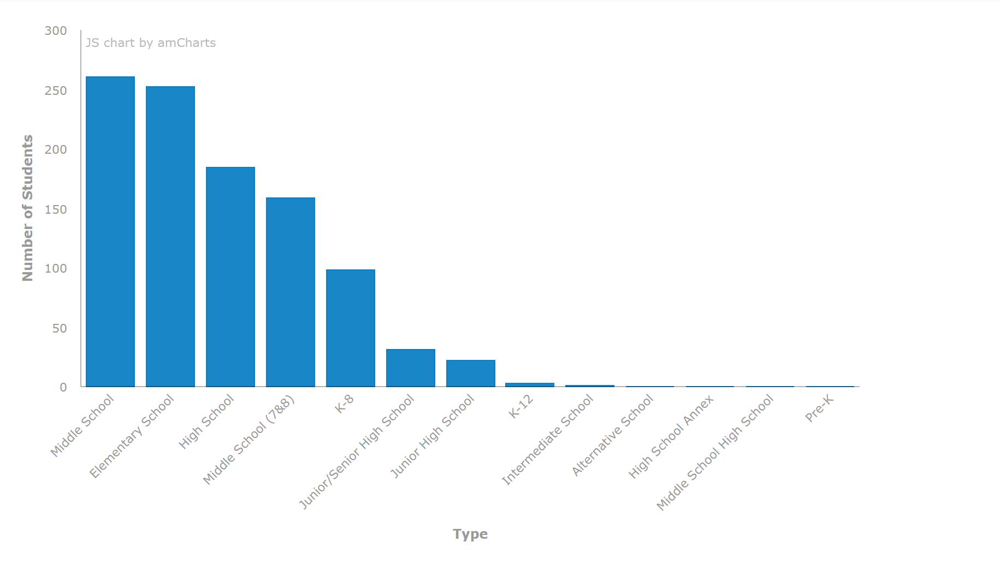
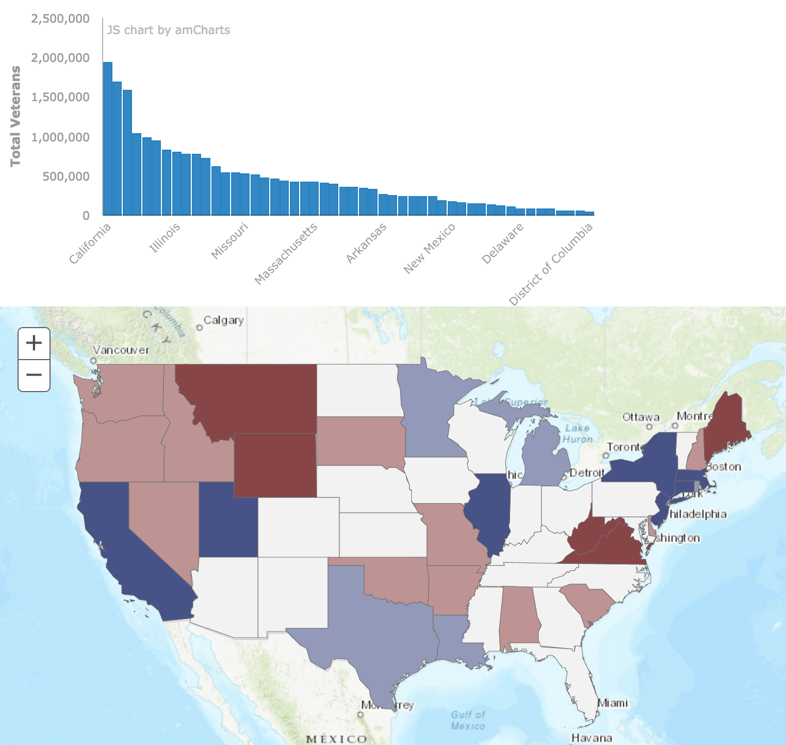
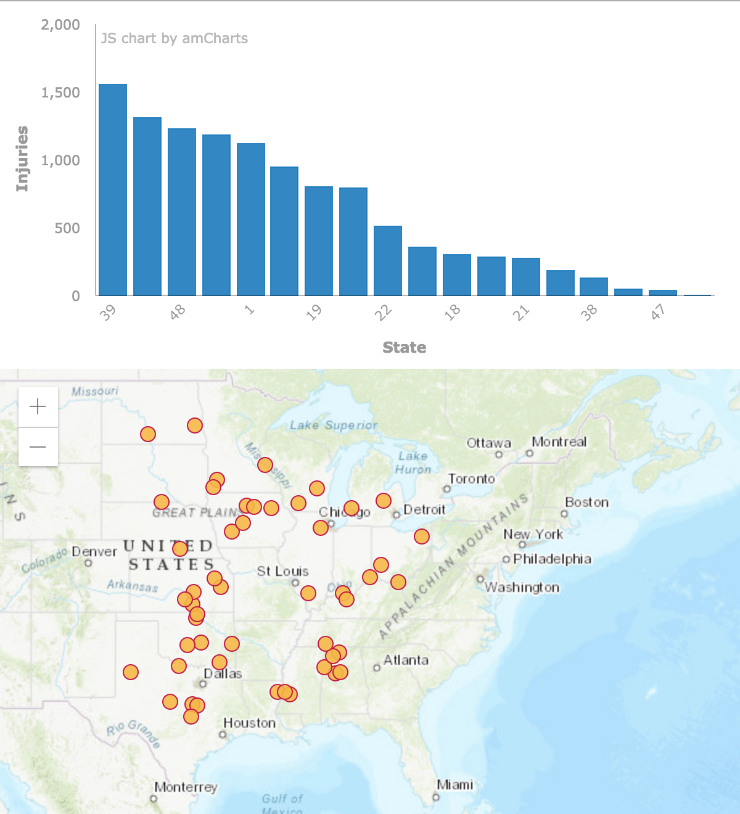

<!-- .slide: data-background="../template/images/Slide7.PNG" -->

<!--div style="margin: auto; padding-top: 50px; padding-bottom: 50px; width: 80%; background: rgba(30,30,30,0.9)"/-->

<h1>Data Visualizations</h1>
 

<br>
Rene Rubalcava, Esri
David Martinez, Esri 

---

<!-- .slide: data-background="../template/images/Slide6.png" -->

  ## [Cedar](https://github.com/esri/cedar)
  
</div>
<h3>JavaScript Charts for ArcGIS</h3>

---

<!-- .slide: data-background="../template/images/Slide6.png" -->

<h3>
Integrated with ArcGIS</h3>

<small class="fragment">Use `url` / `query` or `featureSet`</small>

---


<!-- .slide: data-background="../template/images/Slide6.png" -->

<h3>
 Smart Defaults</h3>

<small class="fragment">(with overrides)</small>

Note:
More and more means aligning w/ Pro's defaults

---


<!-- .slide: data-background="../template/images/Slide6.png" -->

<h3>
Extend, re-use, share</h3>

Note:
find yourself making same overrides again and again, create own chart type

---

<!-- .slide: data-background="../template/images/Slide6.png" -->

### Process

<div class="center-align">
  <div class="stack fragment">
    
    
  </div>
  <div class="stack fragment">
    
    
  </div>
  <div class="stack fragment">
    <code style="font-size: 2em">{}</code>
    <br><code style="font-size: .6em">definition</code>
  </div>
  <div class="fragment">
    
  </div>
  <div class="fragment">
    
  </div>
</div>

---


<!-- .slide: data-background="../template/images/Slide6.png" -->

<h3>
Getting started</h3>

---


<!-- .slide: data-background="../template/images/Slide6.png" -->

<a href="https://codepen.io/davidjmart/pen/WPoQBE"></a>

Let's build [this chart](https://codepen.io/davidjmart/pen/WPoQBE)

---

<!-- .slide: data-background="../template/images/Slide6.png" -->

### Install with package manager
<div><code>npm install --save @esri/cedar</code></div>
<div class="fragment">or <code>yarn add @esri/cedar</code></div>

---

<!-- .slide: data-background="../template/images/Slide6.png" -->

### Or from CDN

```html
<!-- load the amCharts base library -->
<script src="https://www.amcharts.com/lib/3/amcharts.js"></script>
<!-- for bar, line, and area charts -->
<script src="https://www.amcharts.com/lib/3/serial.js"></script>
<!-- optionally load calcite theme -->
<script src="https://unpkg.com/@esri/cedar/dist/umd/themes/amCharts/calcite.js"></script>
<!-- load cedar -->
<script src="https://unpkg.com/@esri/cedar"></script>
```

---

<!-- .slide: data-background="../template/images/Slide6.png" -->

### Build definition

```js
var definition = {};
```
<ul>
  <li class="fragment">Just a POJO</li>
  <li class="fragment">Minimum: `type`, `datasets`, `series`</li>
<ul>

---

<!-- .slide: data-background="../template/images/Slide6.png" -->

### Definition `type`

```js
definition.type = 'bar';
```
<ul>
  <li class="fragment">Predefined: `'bar'`, `'line'`, `'scatter'`, `'pie'`</li>
  <li class="fragment">Or provide your own: `specification: {...}`</li>
<ul>


---


<!-- .slide: data-background="../template/images/Slide6.png" -->

### Definition `datasets`

```js
definition.datatsets = [{
  url: "https://server.arcgisonline.com/arcgis/rest/services/Demographis/USA_Population_Density/MapServer/4",
  query: { orderByFields: "TotPop DESC" }
}]
```

---

<!-- .slide: data-background="../template/images/Slide6.png" -->

### Definition `series`

```js
definition.series = [
  {
    category: {field:"NAME",label:"US State"},
    value: {field:"TOTPOP_CY",label:"Population"}
  }
]
```

---
<!-- .slide: data-background="../template/images/Slide6.png" -->

### Create chart instance (ESM)


```js
import { Chart } from '@esri/cedar';

// create a new cedar chart at a specified element
const myChart = new Chart('elementId', definition)
```

---

<!-- .slide: data-background="../template/images/Slide6.png" -->

### Create chart instance (UMD)


```js
// create a new cedar chart at a specified element
var myChart = new cedar.Chart('elementId', definition)
```

&nbsp;

---

<!-- .slide: data-background="../template/images/Slide6.png" -->

### Show the chart

```js
// execute query and render chart
cedarChart.show()
```

---
<!-- .slide: data-background="../template/images/Slide6.png" -->

<h3> Working with maps</h3>

---
<!-- .slide: data-background="../template/images/Slide6.png" -->

### Charting features

<a href="https://codepen.io/davidjmart/pen/daOYgB"></a>

---
<!-- .slide: data-background="../template/images/Slide6.png" -->

### Dataset `data`

```js
definition.datatsets = [{
  data: { features: graphics }
}]
```

Expects a [FeatureSet](https://esri.github.io/arcgis-rest-js/api/common-types/IFeatureSet/)

Note:
- _instead_ of `url` and `query`

---
<!-- .slide: data-background="../template/images/Slide6.png" -->

### Use JavaScript to filter/sort

```js
graphics.sort(function(a, b) {
  return b.attributes.Grand_Tota -a.attributes.Grand_Tota;
});
```

---

<!-- .slide: data-background="../template/images/Slide6.png" -->

### Aggregating map data

<a href="https://codepen.io/davidjmart/pen/daOYgB"></a>

---
<!-- .slide: data-background="../template/images/Slide6.png" -->

### Dataset `data` with aggregate `query`

```js
definition.datasets: [{
  url: "https://services.arcgis.com/bkrWlSKcjUDFDtgw/arcgis/rest/services/It's_a_Tornado_Map/FeatureServer/0",
  query: {
    groupByFieldsForStatistics: "state",
    outStatistics: [{
      statisticType: "sum",
      onStatisticField: "injuries",
      outStatisticFieldName: "injuries_SUM"
    }]
  }
}]
```

Accepts any [valid query parameters](https://esri.github.io/arcgis-rest-js/api/feature-service/IQueryFeaturesParams/)

---
<!-- .slide: data-background="../template/images/Slide6.png" -->

### Chart [types](http://cedar-v1.surge.sh/)

<a href="http://cedar-v1.surge.sh/?type=bar"></a>
<a href="http://cedar-v1.surge.sh/?type=line"></a>
<a href="http://cedar-v1.surge.sh/?type=area"></a>
<a href="http://cedar-v1.surge.sh/?type=scatter"></a>
<a href="http://cedar-v1.surge.sh/?type=pie"></a>
<a href="http://cedar-v1.surge.sh/?type=bar-grouped"></a>

---
<!-- .slide: data-background="../template/images/Slide6.png" -->

### Overriding chart defaults

```js
definition.overrides = {
  categoryAxis: {
    labelRotation: -45
  },
  legend: {
    enabled: true
  }
}
```

Accepts any [amCharts config parameters](https://docs.amcharts.com/3/javascriptcharts/AmChart)

---

<!-- .slide: data-background="../template/images/Slide6.png" -->

### Better to use cedar API

```js
definition.overrides = {
  categoryAxis: {
    labelRotation: -45
  }
}

definition.legend = {
  visible: true
}
```

Note:
- we're expanding API
- aligning w/ shared chart spec


---

<!-- .slide: data-background="../template/images/Slide6.png" -->

### Create your own chart specification

```js
definition.specification = {
  type: 'serial',
  categoryField: 'category',
  categoryAxis: {
    gridPosition: 'start'
  },
  graphs: [
    {
      title: 'Graph title',
      valueField: 'column-1'
    }
  ],
  valueAxes: [
    {
      title: 'Axis title'
    }
  ],
  legend: {
    useGraphSettings: true
  },
  titles: [
    {
      size: 15,
      text: 'Chart Title'
    }
  ]
}

```

Accepts any [amCharts config parameters](https://docs.amcharts.com/3/javascriptcharts/AmChart) -->

---
